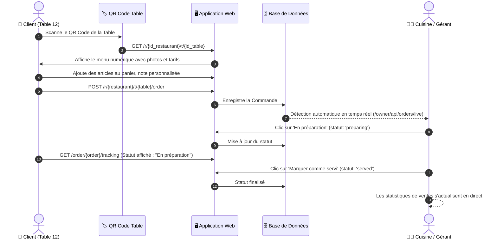

# 🍽️ SmartRestaurant OS (SmartRestau)

<p align="center">
  
</p>

<p align="center">
  <strong>Le Système d'Exploitation Moderne et Infrastructure de Commande par QR Code pour Restaurants</strong>
</p>

<p align="center">
  <a href="#-stack-technologique"></a>
  <a href="#-stack-technologique"></a>
  <a href="#-stack-technologique"></a>
  <a href="#-stack-technologique"></a>
  <a href="#-déploiement-docker--production"></a>
  <a href="#-déploiement-docker--production"></a>
  <a href="#-licence"></a>
</p>

<p align="center">
  <a href="README.md"><strong>English</strong></a> •
  <a href="README.fr.md"><strong>Français</strong></a> •
  <a href="docs/ARCHITECTURE.md"><strong>Architecture Détaillée</strong></a>
</p>

---

## 📖 Sommaire

- [Présentation & Vision](#-présentation--vision)
- [Problématique & Solution Apportée](#-problématique--solution-apportée)
- [Architecture du Système & Flux](#-architecture-du-système--flux)
- [Fonctionnalités Clés](#-fonctionnalités-clés)
  - [1. Expérience Client (QR sans application)](#1-expérience-client-qr-sans-application)
  - [2. Tableau de Bord Propriétaire & Écran Cuisine](#2-tableau-de-bord-propriétaire--écran-cuisine)
  - [3. Support Réseau Local (LAN) & Hors-ligne](#3-support-réseau-local-lan--hors-ligne)
  - [4. Administration de la Plateforme](#4-administration-de-la-plateforme)
- [Stack Technologique](#-stack-technologique)
- [Guide de Démarrage](#-guide-de-démarrage)
  - [Prérequis](#prérequis)
  - [Installation](#installation)
  - [Comptes Démo & Identifiants de Test](#comptes-démo--identifiants-de-test)
- [Guide de Test sur Réseau Local (Wi-Fi / LAN)](#-guide-de-test-sur-réseau-local-wi-fi--lan)
- [Tests Automatisés](#-tests-automatisés)
- [Déploiement Docker & Production](#-déploiement-docker--production)
- [Feuille de Route (Roadmap)](#-feuille-de-route-roadmap)
- [Contribution](#-contribution)
- [Licence](#-licence)

---

## 🌟 Présentation & Vision

**SmartRestaurant OS** est un système d'exploitation numérique full-stack et open-source conçu pour moderniser, simplifier et propulser les opérations quotidiennes des restaurants.

Considérez-le comme **« Le Shopify des Opérations de Restauration »** :
Plutôt que d'imposer aux clients le téléchargement fastidieux d'une application ou d'obliger les restaurateurs à payer d'importantes commissions aux agrégateurs de livraison tiers, SmartRestaurant OS dote chaque restaurant de sa propre infrastructure numérique indépendante.

```
 Restauration Traditionnelle : Client ──(attente)──► Serveur ──(note papier)──► Cuisine ──► Retards & Erreurs
 SmartRestaurant OS :         Client ──[Scan QR]──► Menu Web Instantané ──► Écran Cuisine en Direct ──► Service Rapide
```

### Piliers Stratégiques
1. **Zéro Friction Client :** Le client scanne un QR code de table qui s'ouvre instantanément dans le navigateur de son téléphone, sans inscription obligatoire ni application à installer.
2. **Opérations en Temps Réel :** Tableau de commande en direct pour la cuisine avec rafraîchissement automatique et synchronisation des statuts.
3. **Architecture Résiliente :** Fonctionne aussi bien en déploiement Cloud (Docker / Fly.io) qu'en réseau local (LAN / Wi-Fi) sans connexion Internet externe.
4. **Adapté aux Marchés Émergents :** Prise en charge native des devises locales (FCFA / calculs entiers) et simulation de paiement par Mobile Money (MTN MoMo, Orange Money) et espèces.

---

## 🎯 Problématique & Solution Apportée

| Difficulté du Restaurant Traditionnel | Solution SmartRestaurant OS |
|---|---|
| **Service en salle ralenti :** Les clients attendent 10 à 20 minutes avant de recevoir un menu papier et de commander. | **Accès QR Instantané :** Les convives scannent le QR code et consultent les plats en moins de 3 secondes. |
| **Commandes perdues ou mal comprises :** Écriture manuscrite illisible et erreurs de transmission causant du gaspillage. | **Bons de Commande Numériques :** Les commandes arrivent instantanément avec les options et notes précises en cuisine. |
| **Coût d'impression des cartes :** Plats épuisés, changements de prix et usure imposent des réimpressions fréquentes. | **Menu Dynamique en Direct :** Les prix et la disponibilité des plats s'actualisent en un clic depuis le tableau de bord. |
| **Rotation lente des tables :** L'attente du serveur pour l'addition limite le nombre de couverts en heure de pointe. | **Commande & Paiement Fluides :** L'accélération du cycle de commande permet de doubler la rotation des tables. |
| **Connexion Internet Instable :** Les coupures de réseau fréquentes pénalisent l'utilisation d'outils purement SaaS. | **Mode Réseau Local (LAN) :** Le serveur fonctionne sur le réseau Wi-Fi local du restaurant via une IP dédiée. |

---

## 📐 Architecture du Système & Flux

### 1. Flux Opérationnel Double



---

## ⚡ Fonctionnalités Clés

### 1. Expérience Client (QR sans application)
- **Accès Navigateur Immédiat :** Zéro friction, compatible avec l'appareil photo de n'importe quel smartphone.
- **Reconnaissance de Table :** Détecte automatiquement l'établissement et le numéro de table exact.
- **Navigation Catégorisée Fluide :** Entrées, Plats Principaux, Boissons, Desserts propulsés par Alpine.js.
- **Instructions Spéciales :** Notes personnalisées (ex: *"sans piment"*, *"cuisson à point"*).
- **Simulation de Paiement :** Mobile Money (MTN MoMo, Orange Money) et règlement en Espèces.
- **Suivi de Commande en Direct :** Barre de progression visuelle (`En attente` ➔ `En préparation` ➔ `Servi`).

### 2. Tableau de Bord Propriétaire & Écran Cuisine
- **Écran de Commandes en Direct :** Polling automatique toutes les 10 secondes sans rechargement de page.
- **Gestion des Statuts de Préparation :** Transition en un clic de `En attente` vers `En préparation` puis `Servi`.
- **Bouton Rupture de Stock :** Désactivation instantanée d'un plat sur les tables des clients.
- **Gestion des Tables & QR Codes :**
  - Numérotation libre (Table 1, Table 2, Espace VIP).
  - Génération de QR codes vectoriels SVG haute résolution.
  - Lien direct **"Voir le Menu"** sous chaque table pour tester rapidement depuis un ordinateur.
  - **Impression PDF en Lot :** Téléchargement au format A4 de chevalets de table prêts à imprimer.
- **Statistiques en Temps Réel :** Chiffre d'affaires de la journée, nombre de commandes et tables actives.

### 3. Support Réseau Local (LAN) & Hors-ligne
- Idéal pour les restaurants situés dans des zones à faible débit internet ou avec réseau interne privé.
- Le restaurateur configure l'URL de son réseau local (ex: `http://192.168.1.50:8000`) dans son profil.
- Les QR codes générés pointent automatiquement vers l'adresse locale pour un fonctionnement direct sur le Wi-Fi de l'établissement.

### 4. Administration de la Plateforme
- Interface super-admin dédiée accessible via `/admin/dashboard`.
- Supervision globale des restaurants partenaires, nombre de tables et volume d'activité.
- Activation ou suspension d'un restaurant en un clic.

---

## 🛠️ Stack Technologique

| Couche | Technologie | Rôle |
|---|---|---|
| **Framework Backend** | [Laravel 13.x](https://laravel.com) | Architecture MVC moderne et robuste |
| **Langage** | [PHP 8.3+](https://php.net) | Typage strict et performances JIT |
| **Design & UI** | [Tailwind CSS v4](https://tailwindcss.com) | Moteur CSS utilitaire haute performance |
| **Composants Réactifs** | [Alpine.js 3.x](https://alpinejs.dev) | Micro-interactions fluides et légères |
| **Compilateur d'Assets** | [Vite 8.x](https://vitejs.dev) | Outil de build moderne ultra-rapide |
| **Génération QR Code** | [Simple-QRCode](https://www.simplesoftware.io/docs/simple-qrcode) | Rendu vectoriel SVG & PNG |
| **Génération PDF** | [Barryvdh Laravel DomPDF](https://github.com/barryvdh/laravel-dompdf) | Fiches de tables A4 imprimables |
| **Base de Données** | SQLite / MySQL / PostgreSQL | Données relationnelles avec identifiants UUID |
| **Serveur d'Application** | [FrankenPHP 1.4](https://frankenphp.dev) / Caddy | Serveur PHP moderne ultra-rapide et reverse-proxy |
| **Déploiement Cloud** | [Fly.io](https://fly.io) | Conteneurisation avec volume persistant |

---

## 🚀 Guide de Démarrage

### Prérequis
Assurez-vous de disposer des outils suivants :
- **PHP >= 8.3** (extensions requises : `pdo`, `sqlite3` ou `mysql`, `mbstring`, `gd`, `intl`, `bcmath`)
- **Composer** (gestionnaire de dépendances PHP)
- **Node.js >= 20.x** & **npm**

### Installation

1. **Cloner le dépôt :**
   ```bash
   git clone https://github.com/Alchimiste237/SmartRestau.git
   cd SmartRestau
   ```

2. **Installer les dépendances PHP :**
   ```bash
   composer install
   ```

3. **Installer et compiler les dépendances frontend :**
   ```bash
   npm install
   npm run build
   ```

4. **Configurer l'environnement :**
   ```bash
   cp .env.example .env
   php artisan key:generate
   ```

5. **Exécuter les migrations et injecter les données de test :**
   ```bash
   php artisan migrate --seed
   ```

6. **Lancer le serveur de développement :**
   ```bash
   php artisan serve
   ```
   *L'application est disponible sur [http://127.0.0.1:8000](http://127.0.0.1:8000).*

---

## 🔐 Comptes Démo & Identifiants de Test

Le seeder configure automatiquement des comptes prêts à l'emploi :

| Rôle | Adresse Email | Mot de passe | Accès |
|---|---|---|---|
| **Administrateur Système** | `admin@smartrestau.os` | `admin123` | Supervision globale (`/admin/dashboard`) |
| **Restaurateur (Urban Grill)** | `owner@urbangrill.com` | `owner123` | Gestion restaurant & commandes en direct (`/owner/dashboard`) |
| **Client (Menu Test)** | *(Accès public)* | *(Aucun)* | Table 12 : `/r/{id_urban_grill}/t/{id_table_12}` |

### Tester le Flux de Commande en 60 Secondes :
1. Connectez-vous sur [http://127.0.0.1:8000/login](http://127.0.0.1:8000/login) avec `owner@urbangrill.com` / `owner123`.
2. Dans l'onglet **Tables**, cliquez sur **"Voir le Menu"** sous la Table 12 (ouvre le menu client dans un nouvel onglet).
3. Ajoutez des **Ailes de Poulet Braisées** au panier et choisissez **Mobile Money** (saisissez n'importe quel numéro/code).
4. Retournez sur le tableau de bord du gérant : la commande apparaît en direct dans les **10 secondes** avec notification visuelle !
5. Cliquez sur **"En préparation"** puis sur **"Marquer comme servi"** pour constater l'actualisation des statistiques de vente.

---

## 📶 Guide de Test sur Réseau Local (Wi-Fi / LAN)

Pour tester la commande depuis un vrai smartphone connecté au Wi-Fi :

1. **Obtenir l'adresse IP locale de votre machine :**
   - **Windows :** Exécutez `ipconfig` (ex: `192.168.1.50`)
   - **macOS / Linux :** Exécutez `ifconfig` ou `ip a`

2. **Démarrer Laravel accessible sur le réseau local :**
   ```bash
   php artisan serve --host=0.0.0.0 --port=8000
   ```

3. **Configurer l'URL Réseau Local dans SmartRestaurant OS :**
   - Connectez-vous en tant que propriétaire (`/owner/profile`).
   - Dans le champ **Support Réseau Local (LAN)**, renseignez : `http://192.168.1.50:8000`
   - Enregistrez les modifications.

4. **Scanner depuis votre smartphone :**
   - Connectez votre smartphone au même réseau Wi-Fi.
   - Rendez-vous sur la page **Tables** sur votre ordinateur et scannez le QR code avec l'appareil photo du téléphone.
   - Le menu s'ouvre directement sur votre téléphone !

---

## 🧪 Tests Automatisés

Pour lancer la suite de tests automatisés :
```bash
php artisan test
```

Pour exécuter spécifiquement le test du parcours client complet :
```bash
php artisan test tests/Feature/RestaurantJourneyTest.php
```

---

## 🐳 Déploiement Docker & Production

### Construction de l'image Docker
```bash
# Construire l'image Docker
docker build -t smartrestaurant-os:latest .

# Tester localement le conteneur
docker run -p 8080:8080 -e APP_KEY=base64:... smartrestaurant-os:latest
```

### Déploiement sur Fly.io
Le dépôt intègre le fichier `fly.toml` avec volume persistant pour la base de données SQLite et certificat HTTPS Caddy automatisé :
```bash
fly auth login
fly deploy
```

---

## 🗺️ Feuille de Route (Roadmap)

```
┌────────────────────────────────┐     ┌────────────────────────────────┐     ┌────────────────────────────────┐
│            PHASE 1             │ ──► │            PHASE 2             │ ──► │            PHASE 3             │
│    OS Restaurant Autonome      │     │   Découverte & Réservations    │     │ Super-App & Hub Financier      │
└────────────────────────────────┘     └────────────────────────────────┘     └────────────────────────────────┘
 • Commande à Table par QR Code         • Annuaire Public de Découverte        • Rapprochement Mobile Money direct
 • Écran Cuisine en Temps Réel          • Moteur de Réservation de Tables      • Expédition de Coursiers en Ligne
 • Mode Réseau Local / Hors-ligne       • Avis Clients & Fidélité              • Gestion des Stocks & Fournisseurs
 • Chevalets de Table PDF Imprimables   • Statistiques Avancées de Ventes      • Gestion Multi-Établissements
```

---

## 🤝 Contribution

Les contributions sont les bienvenues ! Pour participer :
1. Forkez le projet (`https://github.com/Alchimiste237/SmartRestau/fork`).
2. Créez une branche dédiée (`git checkout -b feature/nouvelle-fonctionnalite`).
3. Validez vos modifications (`git commit -m 'feat: ajout notification sonore cuisine'`).
4. Poussez sur votre branche (`git push origin feature/nouvelle-fonctionnalite`).
5. Ouvrez une Pull Request.

---

## 📄 Licence

Ce projet est distribué sous licence libre [MIT](LICENSE).

<p align="center">
  Développé avec passion par <a href="https://github.com/Alchimiste237">Alchimiste237</a> et les contributeurs de SmartRestaurant OS.
</p>
