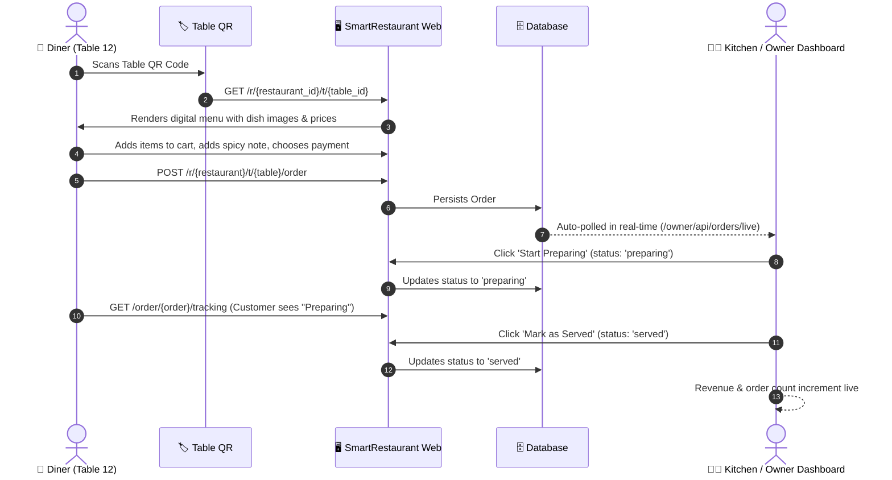
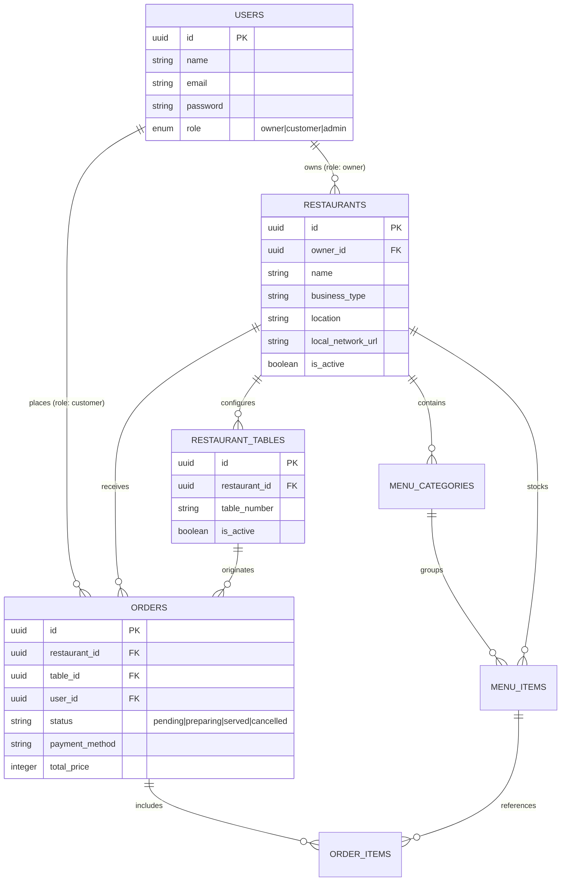

# 🍽️ SmartRestaurant OS (SmartRestau)

<p align="center">
  
</p>

<p align="center">
  <strong>The Modern Operating System & QR-Powered Table Ordering Infrastructure for Restaurants</strong>
</p>

<p align="center">
  <a href="#-tech-stack"></a>
  <a href="#-tech-stack"></a>
  <a href="#-tech-stack"></a>
  <a href="#-tech-stack"></a>
  <a href="#-docker--production-deployment"></a>
  <a href="#-docker--production-deployment"></a>
  <a href="#-license"></a>
</p>

<p align="center">
  <a href="README.md"><strong>English</strong></a> •
  <a href="README.fr.md"><strong>Français (French)</strong></a> •
  <a href="docs/ARCHITECTURE.md"><strong>Architecture Deep Dive</strong></a>
</p>

---

## 📖 Table of Contents

- [Overview & Vision](#-overview--vision)
- [The Core Problem & Solution](#-the-core-problem--solution)
- [System Architecture & Flows](#-system-architecture--flows)
- [Key Features](#-key-features)
  - [1. Customer Dining Experience (Zero-App QR)](#1-customer-dining-experience-zero-app-qr)
  - [2. Restaurant Owner & Kitchen Display](#2-restaurant-owner--kitchen-display)
  - [3. Offline LAN & Wi-Fi Support](#3-offline-lan--wi-fi-support)
  - [4. Platform Administration](#4-platform-administration)
- [Tech Stack](#-tech-stack)
- [Getting Started](#-getting-started)
  - [Prerequisites](#prerequisites)
  - [Installation Steps](#installation-steps)
  - [Demo Accounts & Test Credentials](#demo-accounts--test-credentials)
- [Local Network (LAN) Testing Guide](#-local-network-lan-testing-guide)
- [Automated Testing](#-automated-testing)
- [Docker & Production Deployment](#-docker--production-deployment)
- [Roadmap & Scalable Vision](#-roadmap--scalable-vision)
- [Contributing](#-contributing)
- [License](#-license)

---

## 🌟 Overview & Vision

**SmartRestaurant OS** is an open-source, full-stack digital operating system engineered to transform traditional restaurants into high-efficiency, digitally orchestrated hospitality businesses. 

Think of it as **"The Shopify for Restaurant Operations"**:
Instead of burdening customers with mandatory mobile app downloads or forcing restaurants to pay hefty commissions to third-party delivery aggregators, SmartRestaurant OS provides restaurants with their own independent digital infrastructure.

```
 Traditional Dining:  Customer ──(wait)──► Waiter ──(manual note)──► Kitchen ──► Delay & Errors
 SmartRestaurant OS: Customer ──[Scan QR]──► Instant Web Menu ──► Live Kitchen Screen ──► Speedy Delivery
```

### Strategic Value Pillars
1. **Zero Customer Friction:** Customers scan an on-table QR code that opens instantly in any mobile browser. No downloads, no account setup barrier.
2. **Real-Time Operations:** Live order boards for the kitchen with automated polling and status sync.
3. **Resilient Architecture:** Works in urban cloud deployments (Fly.io/Docker) and in local environments with offline LAN/Wi-Fi support.
4. **Emerging Market Ready:** Native support for local currency formatting (FCFA / integer math) and simulated Mobile Money checkout (MTN MoMo, Orange Money).

---

## 🎯 The Core Problem & Solution

| Traditional Restaurant Pain Point | SmartRestaurant OS Solution |
|---|---|
| **Slow table service:** Customers wait 10-20 minutes just to get a physical menu and place an order. | **Instant QR Access:** Diners scan table QR codes and browse meals in under 3 seconds. |
| **Lost & misunderstood orders:** Waiters handwriting errors and kitchen miscommunication cause food waste. | **Direct Digital Tickets:** Orders flow with exact modifiers and notes straight to the kitchen screen. |
| **Expensive printed paper menus:** Out-of-stock items, price changes, and wear-and-tear require costly reprints. | **Dynamic Real-Time Menu:** Prices and 86-ed / out-of-stock items can be updated in one click. |
| **Table turn bottlenecks:** Waiting for the waiter to bring the bill limits peak-hour revenue. | **Rapid Checkout Simulation:** Faster ordering cycles directly double table turnover capacity. |
| **Unreliable Internet:** Emerging market restaurants often suffer from intermittent cloud connectivity. | **Offline LAN Mode:** Server runs locally over internal Wi-Fi with custom IP overrides. |

---

## 📐 System Architecture & Flows

### 1. Dual Operational Flow



### 2. Multi-Tenant Entity Model



---

## ⚡ Key Features

### 1. Customer Dining Experience (Zero-App QR)
- **Instant Browser Access:** No App Store or Play Store friction. Works with any standard camera app.
- **Table Recognition:** Automatically identifies both the specific restaurant and the exact table number.
- **Dynamic Category Navigation:** Starters, Main Dishes, Drinks, Desserts with smooth Alpine.js tabs.
- **Dish Details & Custom Notes:** Add specific dietary requests (e.g., *"extra chili"*, *"no onions"*).
- **Payment Gateway Simulation:** Mobile Money (MTN MoMo, Orange Money) and Cash on Delivery.
- **Live Status Tracking:** Real-time visual progress tracker (`Pending` ➔ `Preparing` ➔ `Served`).

### 2. Restaurant Owner & Kitchen Display
- **Live Order Board:** Dashboard polls `/owner/api/orders/live` every 10 seconds to display new incoming orders without needing page refreshes.
- **Status Workflow Actions:** Single-click transitions from `Pending` to `Start Preparing` to `Mark as Served`.
- **Instant Availability Toggle:** Switch items out-of-stock instantly during a rush; reflected across all customer tables immediately.
- **Table & QR Management:** 
  - Create table numbering structures (e.g., Table 1, Table 2, VIP Room).
  - High-res vector SVG QR codes generated via `simplesoftwareio/simple-qrcode`.
  - Single-click **"View Menu"** direct link next to each QR code for instant desktop testing.
  - **Batch PDF Export:** Download printable, formatted A4 QR table tent cards generated with `barryvdh/laravel-dompdf`.
- **Daily Performance Metrics:** Real-time metrics for total orders today, active tables, and live revenue.

### 3. Offline LAN & Wi-Fi Support
- **Built for Resilient Operations:** In locations with spotty broadband, restaurants can host SmartRestaurant OS on a local computer connected to a local Wi-Fi router.
- **Custom Local Network URL:** Owners can specify their local LAN URL (e.g. `http://192.168.1.15:8000`) in their profile settings.
- All table QR codes and links automatically bind to the local network address, enabling seamless ordering over local Wi-Fi without external internet access.

### 4. Platform Administration
- Dedicated admin portal at `/admin/dashboard`.
- Global visibility into registered restaurant tenants, table counts, and activity.
- One-click restaurant suspension / activation switch.

---

## 🛠️ Tech Stack

| Layer | Technology | Description |
|---|---|---|
| **Backend Framework** | [Laravel 13.x](https://laravel.com) | Expressive, elegant PHP MVC framework |
| **Language** | [PHP 8.3+](https://php.net) | Modern PHP with strict types and JIT support |
| **Frontend Styling** | [Tailwind CSS v4](https://tailwindcss.com) | Modern utility-first CSS engine via `@tailwindcss/vite` |
| **Micro-Interactions** | [Alpine.js 3.x](https://alpinejs.dev) | Lightweight reactive component framework |
| **Asset Bundler** | [Vite 8.x](https://vitejs.dev) | Next-generation fast frontend tooling |
| **QR Code Engine** | [Simple-QRCode](https://www.simplesoftware.io/docs/simple-qrcode) | Vector SVG & PNG QR code generator |
| **PDF Engine** | [Barryvdh Laravel DomPDF](https://github.com/barryvdh/laravel-dompdf) | Server-side PDF table tent cards |
| **Database** | SQLite / MySQL / PostgreSQL | Robust relational data store with UUID primary keys |
| **Application Server** | [FrankenPHP 1.4](https://frankenphp.dev) / Caddy | High-performance modern PHP server & reverse proxy |
| **Cloud Deployment** | [Fly.io](https://fly.io) | Multi-region container deployment with persistent storage |

---

## 🚀 Getting Started

### Prerequisites
Make sure your development machine has:
- **PHP >= 8.3** (with extensions: `pdo`, `sqlite3` or `mysql`, `mbstring`, `gd`, `intl`, `bcmath`)
- **Composer** (PHP dependency manager)
- **Node.js >= 20.x** & **npm**

### Installation Steps

1. **Clone the repository:**
   ```bash
   git clone https://github.com/Alchimiste237/SmartRestau.git
   cd SmartRestau
   ```

2. **Install PHP dependencies:**
   ```bash
   composer install
   ```

3. **Install and build frontend dependencies:**
   ```bash
   npm install
   npm run build
   ```

4. **Configure environment variables:**
   ```bash
   cp .env.example .env
   php artisan key:generate
   ```

5. **Run database migrations and seed demo data:**
   ```bash
   php artisan migrate --seed
   ```

6. **Start the local development server:**
   ```bash
   php artisan serve
   ```
   *The application will be accessible at [http://127.0.0.1:8000](http://127.0.0.1:8000).*

---

## 🔐 Demo Accounts & Test Credentials

The database seeder automatically configures ready-to-test accounts:

| Persona | Email | Password | Role / Access |
|---|---|---|---|
| **System Administrator** | `admin@smartrestau.os` | `admin123` | Full admin management (`/admin/dashboard`) |
| **Restaurant Owner (Urban Grill)** | `owner@urbangrill.com` | `owner123` | Owner dashboard, tables & live orders (`/owner/dashboard`) |
| **Customer (Test Menu)** | *(No login required)* | *(Public)* | Scan / visit Table 12: `/r/{urban_grill_id}/t/{table_12_id}` |

### Testing the Real-Time Order Flow in 60 Seconds:
1. Open [http://127.0.0.1:8000/login](http://127.0.0.1:8000/login) in Window A and log in as `owner@urbangrill.com` / `owner123`.
2. Go to **Tables** and click **"View Menu"** on Table 12 (opens the customer menu in Window B).
3. In Window B, add **Grilled Chicken Wings** to cart and checkout with **Mobile Money** (enter any phone/PIN).
4. Switch back to Window A: within **10 seconds**, the order will appear live on the kitchen dashboard with an alert!
5. Click **"Start Preparing"**, then **"Mark as Served"** to see live stats update.

---

## 📶 Local Network (LAN) Testing Guide

Want to test scanning real QR codes from your smartphone over Wi-Fi without deploying to the cloud?

1. **Find your local machine's IP address:**
   - **Windows:** Run `ipconfig` (e.g., `192.168.1.50`)
   - **macOS/Linux:** Run `ifconfig` or `ip a`

2. **Serve Laravel bound to all interfaces:**
   ```bash
   php artisan serve --host=0.0.0.0 --port=8000
   ```

3. **Configure the LAN URL in SmartRestaurant OS:**
   - Log into your Owner Dashboard: `http://192.168.1.50:8000/login`
   - Navigate to **Restaurant Profile** (`/owner/profile`)
   - In the **Offline LAN Support** field, enter: `http://192.168.1.50:8000`
   - Save changes.

4. **Scan from your phone:**
   - Connect your phone to the same Wi-Fi network.
   - Go to **Tables** on your PC and scan any table QR code with your phone camera.
   - The menu will open directly on your mobile device!

---

## 🧪 Automated Testing

SmartRestaurant OS includes automated feature and integration tests covering the complete customer journey, live polling endpoints, and order state machines.

To run the test suite:
```bash
php artisan test
```

Or run the end-to-end journey test:
```bash
php artisan test tests/Feature/RestaurantJourneyTest.php
```

---

## 🐳 Docker & Production Deployment

### Building with Docker
The project includes an optimized multi-stage Dockerfile leveraging Node for asset compilation and FrankenPHP 1.4 on Alpine Linux for lightning-fast execution:

```bash
# Build the Docker image
docker build -t smartrestaurant-os:latest .

# Run the container locally
docker run -p 8080:8080 -e APP_KEY=base64:... smartrestaurant-os:latest
```

### Deploying to Fly.io
The repository comes pre-configured with `fly.toml`, persistent volume mounts for SQLite storage, and automated Caddy HTTPS provisioning:

```bash
# Authenticate with Fly.io
fly auth login

# Launch / Deploy
fly deploy
```

---

## 🗺️ Roadmap & Scalable Vision

```
┌────────────────────────────────┐     ┌────────────────────────────────┐     ┌────────────────────────────────┐
│            PHASE 1             │ ──► │            PHASE 2             │ ──► │            PHASE 3             │
│   Single-Restaurant OS (MVP)   │     │    Discovery & Aggregation     │     │ Hospitality Super-App & Fintech│
└────────────────────────────────┘     └────────────────────────────────┘     └────────────────────────────────┘
 • QR Table Ordering & Menus            • Public Restaurant Directory          • In-house Mobile Money Settlement
 • Real-time Kitchen Dashboard          • Table Reservation Engine             • Direct Courier Delivery Dispatch
 • Offline LAN Support                  • Customer Review & Loyalty            • Inventory & Supplier Procurement
 • PDF Table Tent Generation            • Advanced Sales Analytics             • Multi-branch Enterprise Chains
```

---

## 🤝 Contributing

Contributions are welcome! Please follow these steps:
1. Fork the repository (`https://github.com/Alchimiste237/SmartRestau/fork`).
2. Create a dedicated feature branch (`git checkout -b feature/amazing-feature`).
3. Commit your changes with conventional commit messages (`git commit -m 'feat: add kitchen sound notification'`).
4. Push to your branch (`git push origin feature/amazing-feature`).
5. Open a Pull Request.

---

## 📄 License

This project is open-sourced software licensed under the [MIT License](LICENSE).

<p align="center">
  Crafted with ❤️ by <a href="https://github.com/Alchimiste237">Alchimiste237</a> & the SmartRestaurant OS Contributors.
</p>
