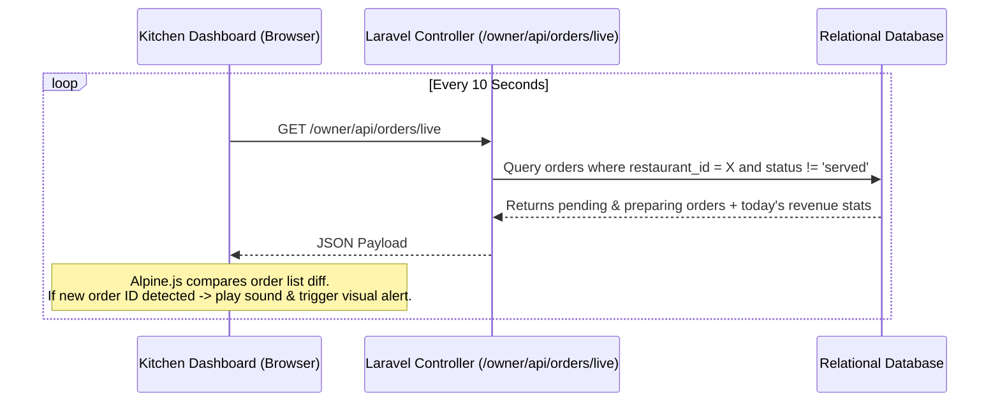

# 🏗️ SmartRestaurant OS — System Architecture & Technical Design

This document details the software architecture, data modeling, networking design, and engineering patterns behind **SmartRestaurant OS**.

---

## 🧭 Architectural Philosophy

SmartRestaurant OS is engineered around three non-negotiable principles:

1. **Zero Client Friction (Zero-Install):** Diners interact through standard mobile web browsers without installing native apps or completing intrusive registrations.
2. **Operational Resilience (Offline & Emerging Market Ready):** High-speed table ordering must function even in environments with high latency, spotty broadband, or zero external internet connectivity.
3. **Multi-Tenant Scalability:** A centralized database structure with UUID segregation that easily scales from a single food truck to a national restaurant chain.

---

## 🏛️ High-Level System Architecture

```
                                  ┌─────────────────────────────┐
                                  │   Diner's Smartphone        │
                                  │   (Camera -> Mobile Browser)│
                                  └──────────────┬──────────────┘
                                                 │ HTTPS / LAN HTTP
                                                 ▼
┌────────────────────────────────────────────────────────────────────────────────────────┐
│                                   CADDY / FRANKENPHP                                   │
│                        (Reverse Proxy + High-Speed Worker Mode)                        │
└────────────────────────────────────────┬───────────────────────────────────────────────┘
                                         │
                                         ▼
┌────────────────────────────────────────────────────────────────────────────────────────┐
│                              LARAVEL 13 APPLICATION CORE                               │
│                                                                                        │
│   ┌─────────────────────┐   ┌─────────────────────┐   ┌────────────────────────────┐   │
│   │   Customer Module   │   │    Kitchen / Owner  │   │     Super Admin Portal     │   │
│   │  - QR Landing       │   │  - Live Order Feed  │   │  - Tenant Oversight        │   │
│   │  - Cart & Checkout  │   │  - Menu Management  │   │  - Activation Switches     │   │
│   │  - Order Tracking   │   │  - Table & QR Engine│   │                            │   │
│   └──────────┬──────────┘   └──────────┬──────────┘   └─────────────┬──────────────┘   │
│              │                         │                            │                  │
│              └─────────────────────────┼────────────────────────────┘                  │
│                                        ▼                                               │
│                        ┌───────────────────────────────┐                               │
│                        │  Eloquent ORM & UUID Models   │                               │
│                        └───────────────┬───────────────┘                               │
└────────────────────────────────────────┼───────────────────────────────────────────────┘
                                         │
                                         ▼
┌────────────────────────────────────────────────────────────────────────────────────────┐
│                              DATA PERSISTENCE & STORAGE                                │
│                                                                                        │
│   ┌─────────────────────────────────────────┐   ┌──────────────────────────────────┐   │
│   │       Relational Database Engine        │   │        Static Asset Storage      │   │
│   │  (SQLite Persistent Volume / MySQL / PG)│   │  (Dishes, Logos, Cover Photos)   │   │
│   └─────────────────────────────────────────┘   └──────────────────────────────────┘   │
└────────────────────────────────────────────────────────────────────────────────────────┘
```

---

## 🔄 Real-Time Order Synchronization

### Why 10-Second Smart Polling?
Rather than relying on heavy, stateful WebSocket servers (e.g., Pusher, Socket.io, or Redis Reverb) which require continuous background daemons, persistent socket connections, and higher memory overhead, SmartRestaurant OS implements **Lightweight Stateful AJAX Polling**:



### Benefits:
- **Zero WebSocket infrastructure costs** or third-party paid subscriptions.
- **Tolerant of mobile disconnections** (automatic exponential backoff or retry on reconnect).
- **Extremely low memory footprint** on the application server.

---

## 🌐 Local Network (Offline LAN) Architecture

In emerging markets and dense urban restaurant areas, broadband connectivity can fluctuate or drop entirely during peak dining hours. SmartRestaurant OS features a **Local Network Override Mechanism**:

```
[Local Wi-Fi Router (No Internet)]
       │
       ├──► Host Laptop running: `php artisan serve --host=0.0.0.0 --port=8000`
       │    (Internal IP: 192.168.1.50)
       │
       ├──► Diner 1 (Phone connected to Wi-Fi) -> Scans QR -> Opens: http://192.168.1.50:8000/r/...
       ├──► Diner 2 (Phone connected to Wi-Fi) -> Scans QR -> Opens: http://192.168.1.50:8000/r/...
       └──► Kitchen Tablet (Connected to Wi-Fi) -> http://192.168.1.50:8000/owner/dashboard
```

### Implementation Details:
1. In `app/Models/Restaurant.php`, the `getTableUrl($tableId)` method inspects the `local_network_url` attribute:
   ```php
   public function getTableUrl($tableId)
   {
       $baseUrl = $this->local_network_url ?: config('app.url');
       $baseUrl = rtrim($baseUrl, '/');
       return "{$baseUrl}/r/{$this->id}/t/{$tableId}";
   }
   ```
2. When the restaurant owner sets `local_network_url = "http://192.168.1.50:8000"`, all generated QR codes, print PDF table tents, and table preview links immediately bind to the local subnet.
3. Orders and kitchen displays communicate flawlessly with zero dependence on external telecom towers or ISP backbones.

---

## 🗄️ Database Schema & Relationships

### Core Entities
- **`users`**: Platform actors (`admin`, `owner`, `customer`).
- **`restaurants`**: The tenant business entity, owned by a `user`. Stores profile metadata, opening hours, branding, and LAN configurations.
- **`menu_categories`**: Groupings of dishes (e.g. Starters, Grills, Cocktails) ordered by `display_order`.
- **`menu_items`**: Individual dishes or drinks, linking to category and restaurant. Prices are stored as integers (e.g., 2500 for 2,500 FCFA) to eliminate floating-point rounding errors.
- **`restaurant_tables`**: Physical table records with custom identifiers (e.g., "Table 12", "Terrace B").
- **`orders`**: Order records containing total amount, payment method, customer reference, and state enum (`pending`, `preparing`, `served`, `cancelled`).
- **`order_items`**: Pivot records specifying `quantity`, unit price snapshot at time of order, and diner preparation notes.

---

## 🔒 Security & Multi-Tenant Segregation

- **UUID Identifiers:** Primary keys across `restaurants`, `tables`, and `orders` use UUIDv4 rather than sequential integer IDs. This prevents sequential enumeration attacks (e.g. competitors cannot deduce order counts or scan other restaurant menus by changing URL numbers).
- **Role-Based Middleware:** Middleware enforces role checks (`admin`, `owner`, `auth`), preventing cross-tenant data leakage.
- **Granular Ownership Checks:** Controllers verify that queried tables, categories, and orders belong directly to the authenticated owner's `restaurant_id`.

---

## 🚀 Production Container Topology

SmartRestaurant OS is packaged as a lightweight Docker container based on Alpine Linux:
- **Web & Application Server:** FrankenPHP 1.4 embeds PHP 8.3 within Caddy, eliminating the need for a separate Nginx + PHP-FPM split.
- **Asset Pipeline:** Multi-stage build compiles Tailwind CSS v4 and JS assets using Node 20, keeping the final production image under 200MB.
- **Data Persistence on Fly.io:** A persistent disk is mounted to `/app/storage`, ensuring that the SQLite database and uploaded images persist across container restarts.
